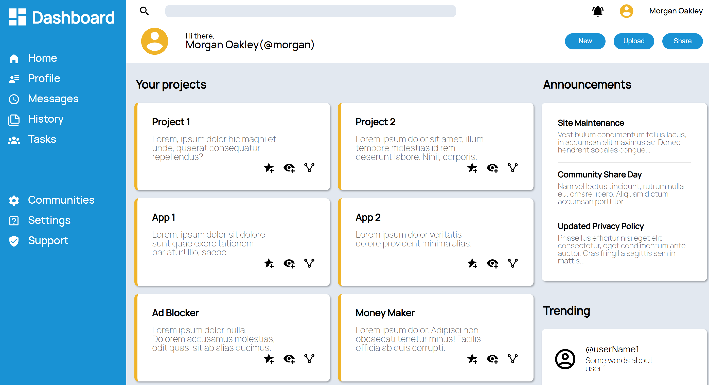

# Responsive Admin Dashboard



## Description
Responsive Admin Dashboard interface built from scratch using pure HTML and CSS.

## Live Preview
[Click here to see the live project](https://hnstz.github.io/Admin-dashboard/)

## Key Features
* **Fully Responsive:** Seamlessly adapts to desktop, tablet, and mobile screens.
* **Modern Layouts:** Extensively uses CSS Grid and Flexbox for complex, dynamic positioning.
* **Semantic HTML5:** Structured for better accessibility and SEO.
* **Custom Typography & Icons:** Integrates custom Manrope web fonts and inline SVGs for crisp, scalable graphics.
* **No Frameworks:** Built entirely with Vanilla CSS to demonstrate a deep understanding of core styling mechanics.

## Technologies Used
* **HTML5**
* **CSS3**

## Architecture & Methodology
To ensure the codebase remains scalable and easy to read, this project adheres to strict frontend development standards:
* **BEM Methodology:** CSS classes are named following the Block Element Modifier (BEM) convention (e.g., `sidebar__item`, `header__user-name--large`). This prevents style leakage and keeps the CSS specificity flat.
* **CSS Grid Areas:** The main layout architecture is powered by `grid-template-areas`, allowing for intuitive repositioning of the sidebar, header, and main content chunks across different screen sizes.
* **CSS Custom Properties (Variables):** Color schemes are managed via root variables for easy maintenance and potential future theming (e.g., Dark Mode).
* **Mobile-First / Adaptive approach:** Media queries are utilized to gracefully degrade the complex dashboard view into a streamlined single-column layout for smaller devices.

## Installation & Setup
To run this project locally, simply follow these steps:

1. Clone the repository:
   ```bash
   git clone [https://github.com/](https://github.com/)[hnatz]/[Admin-dashboard].git
   ```

2. Navigate to the project directory:
    ```bash
    cd Admin-dashboard
    ```

3. Open index.html in your preferred web browser, or use an extension like Live Server in VS Code for hot reloading.
